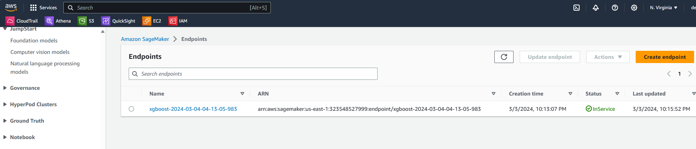

# Model Deployment

To interact with a model, it needs to be accessible in some way, deployed. This section will go into model deployment the different ways models can be deployed (probably linking to other repositories).

To start of with we will deploy the model using AWS Sagemaker. AWS Sagemaker is an AWS service for machine learning also providing an option to deploy an endpoint. This notebook will explore using AWS Sagemaker to create an endpoint for deploymnet. 

In this project will use Sagemaker Notebook to run the code and deploy the endpoint for inference. 

